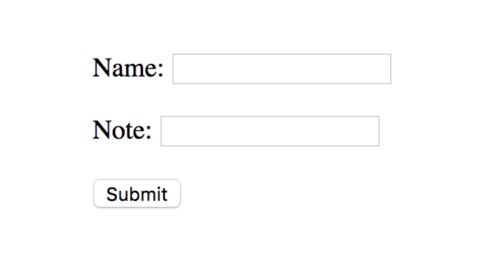
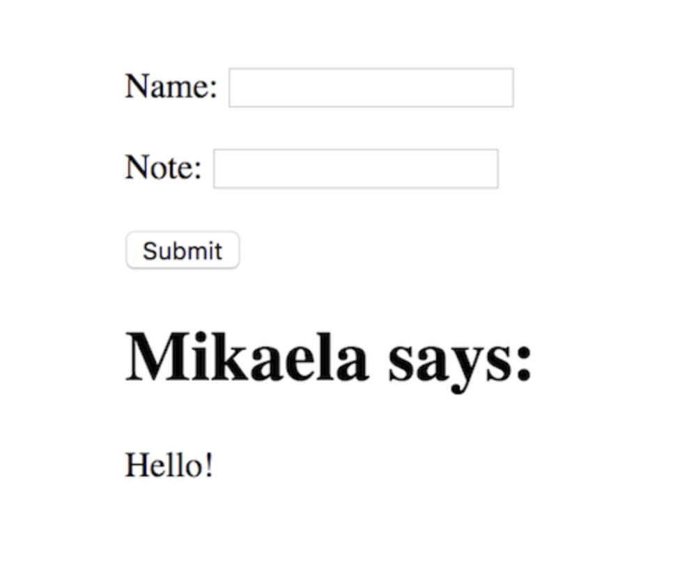

This article covers a simple way to grab some request data from a HTML form, and use Jinja to dynamically change update HTML of a page without the use of JavaScript.

Here’s the functionality that we are trying to reproduce:

Step 1: Empty form


Step 2: User enters data

Step 3: Template updated with data




To begin, you will only need two files:

The template `index.html`

import Gist from "react-gist"

<Gist id="72372adc4f625d57fd17add2d4c739ed"/>

The main application file: `app.py`


<Gist id="e8480876bc55dbe0e62f7b95f69c240b"/>


When looking at html form, we can see that it consists of a few parts:

```
<form method="POST" action="/response">
    <label for="fname">Name:</label><br>
    <input type="text" id="fname" name="fname"><br>
    <label for="note">Note:</label><br>
    <input type="text" id="note" name="note"><br><br>
    <input type="submit" value="Submit">
</form> 
```

The method attribute specifies the type of request that will be made on form submission. The action attribute specifies where to send the form-data when the form is submitted. This endpoint (/response) will be linked to the function controller that you have designed handle this particular request:


```
@app.route('/response', methods=['POST'])
def response():
 fname = request.form["fname"]
 note = request.form["note"]
return render_template("index.html", name=fname, note=note)
```

To access the request data, we will use the global request object, provided by Flask.

 Whenever a request is made, Flask parses the incoming request data for you and stores this information in the request object.
If we are sure that a particular input value has been sent, we may access it with the notation:
`request.form["form_input_name_value"]`

`request.form.get("form_input_name_value")` will alternatively not throw a key-error if the input value name is not found in the request object.
After storing our data in variables, we pass them as parameters to our template using render_template() , which will allow jinja to perform the necessary logic to update the page view.
