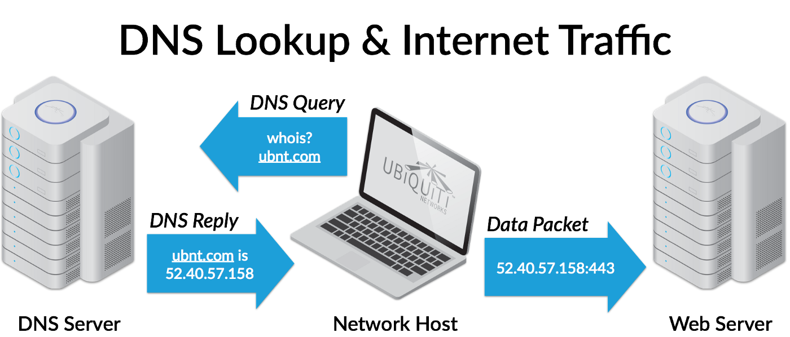
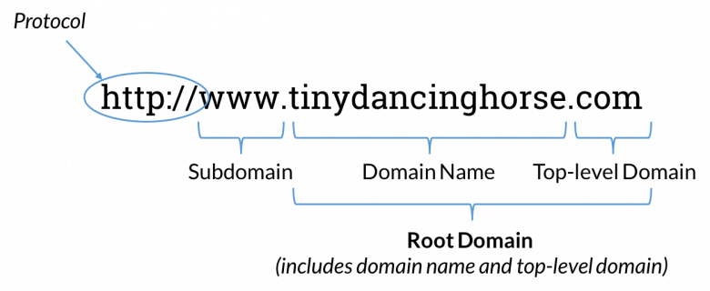
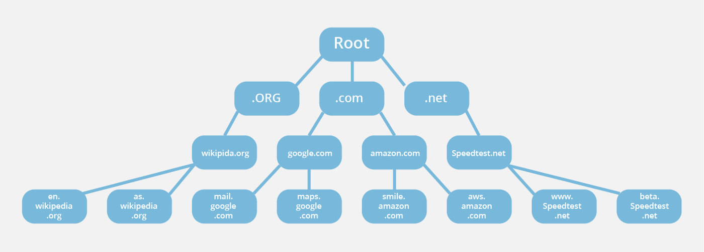
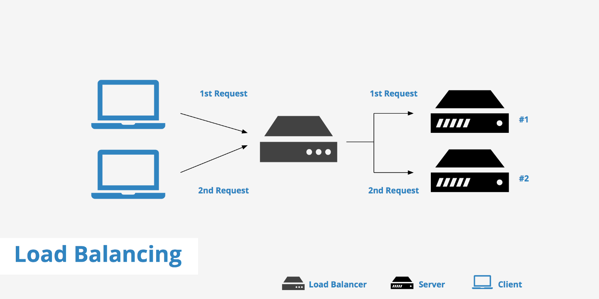
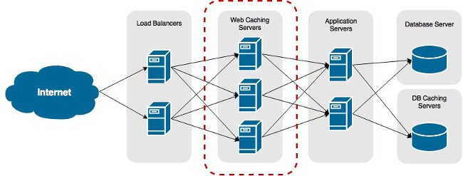

TL;DR: A lot!

Here’s a high-level overview:

To start, let’s look at the URL https://www.example.com

It contains:
- A protocol — https
- A domain name — www.example.com

## Domain Names: IP Addresses in Disguise
What is a domain name? In the same way that you might query Google Maps with the name of a restaurant instead of its physical address, you’ll likely search for a website using its domain name rather than its IP address.

IP addresses are unique sets of numbers (e.g. 151.101.65.121) assigned to each network device, which help these machines identify each other and ensure that data and requests are routed to the correct destinations. Domain names, on the other hand, are the human-friendly, easy-to-remember aliases that refer to these numbers.

## How does your browser translate a domain name into an IP address?

 

 

### Cache check
Before your browser can send its request to the proper web server, it has to figure out which IP address corresponds to the domain name that you have entered.

First, your browser will check its cache(memory) to see if the IP address in question has been previously saved. If it has not, your OS cache will be searched, then your router cache, and finally your ISP (Internet Service Provider) cache will be examined. If the IP has not been stored in any of these locations, a DNS server (generally provided by your ISP) will proceed to resolve the domain name to its IP address.

DNS resolvers are part of the DNS (Domain Name System), which comprises a massive database of domain name and IP address mappings.

### Anatomy of a Domain Name:
Let’s break down the domain name a little more. Domain names consist of multiple parts:
 

 
- The last dot-separated portion is called the top-level domain (.com, .online, .org etc.).

- Each word-and-dot combination that precedes the top-level domain indicates a new level in the domain structure. In www.example.com, ‘example’ would be considered the second-level domain).

- The left-most part of the domain name, (www) is referred to as the host name or subdomain.

### Where are you?
 

 
To locate an IP address, the resolver begins by querying the root DNS server (represented by the invisible ‘.’ at the end of a domain name: www.example.com.←)

Root servers hold the locations of all of the top-level domain servers, which will be queried next, followed by the second-level servers.

After the second-level domain servers are queried, the DNS resolver will be directed to the authoritative name server, which will return the IP address of “www.example.com.” to the browser. The browser will store this address in its cache for a specified amount of time to speed lookup when that particular URL is called again.

## Making a Connection
 

 
TCP/IP (Transmission Control Protocol/Internet Protocol) is a set of procedures and rules for regulating how data is broken up, and exchanged between a client (in this case, your browser) and a server (such as example.com’s). With an IP address, your browser will attempt to initiate a TCP connection with the indicated server in order to send and receive information.

### Connection Security
 

 
In the beginning of this article, I mentioned that https:// was the protocol for www.example.com. HTTPS stands for Hyper Text Transfer Protocol Secure. It is the secure version of HTTP, which is the protocol that defines how messages are formatted and transmitted across the web, and what actions web servers and browsers should perform in response to various commands.

HTTPS increases the security of a connection via SSL(Secured Sockets Layer), a standard security protocol for establishing encrypted links between the client and server via the use of public and private keys. Without SSL, any computer on any other networks between you and the web server can access your connection.
Firewalls also increase security by restricting traffic and preventing unwanted port connections.

### Load Balancers
 

 

Another piece of technology that your request might encounter en route to a web server is a load balancer. Load balancers distribute requests across server systems to increase the reliability, efficiency, and availability of the queried application or website.

### Web, Application, and Database Servers
 

 
Once your request has reached www.example.com’s web server, the web server serves up a HTML file to your browser.

In order to process dynamic content, such as a Javascript file, the web sever must communicate with an application server, which will run the dynamic content, translate the results into static HTML, and return it to the web server.

Databases store website and application data. If requests for such information (usernames, passwords etc.) occur, a query to the database will be made and the relevant data will be sent back to the web server, which will, finally, return the necessary static code to the browser for your viewing pleasure.
